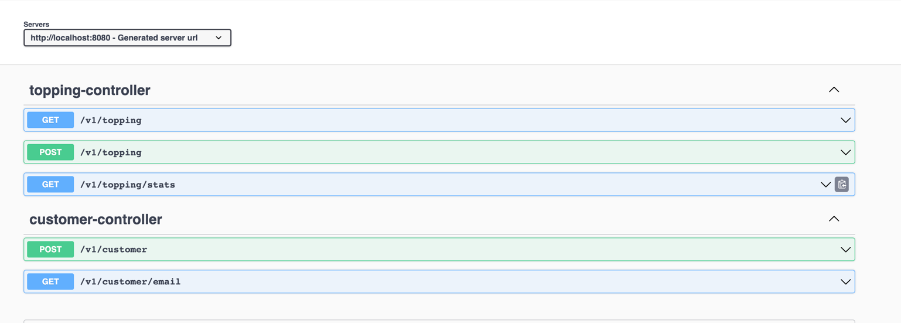

## Configuring Postgres

### 1. Spin up Postgres DB

#### Using Docker compose

- The docker compose file for postgres: [docker-compose.yml](docker/docker-compose.yml)

- Run the below command from /docker folder to spin up Postgres Instance

```
docker-compose up
```
### 2. Test dataset
#### Using swagger-ui
After application startup all available api can be found here: http://localhost:8080/swagger-ui/index.html. You can play with it directly from browser.



#### Using predefined http collections
Here you can find initial setup for toppings (it was used for testing)
[initialToppingsSetup.http](src/main/resources/initialToppingsSetup.http)

